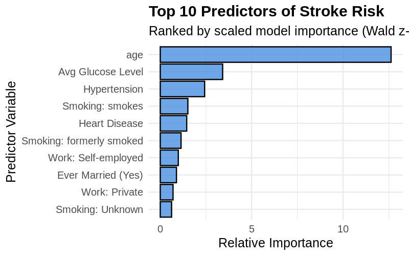
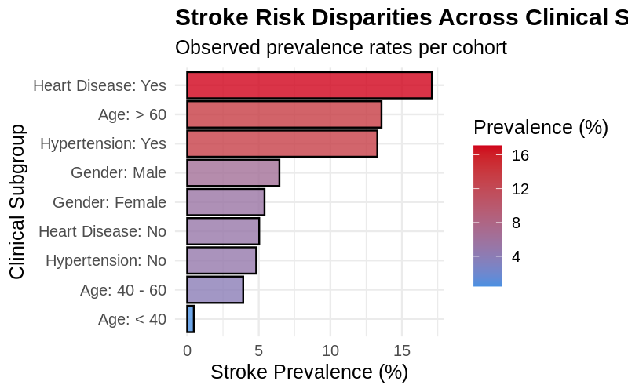
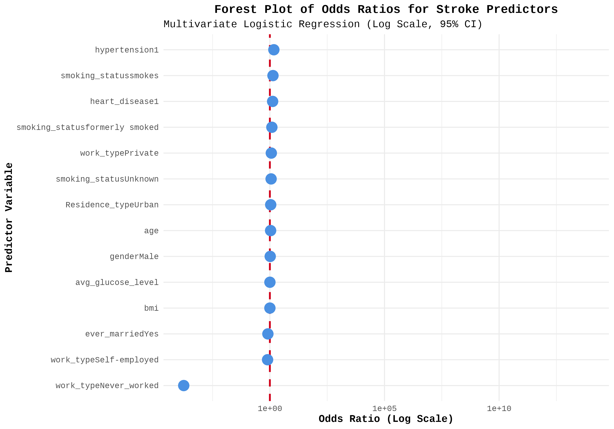
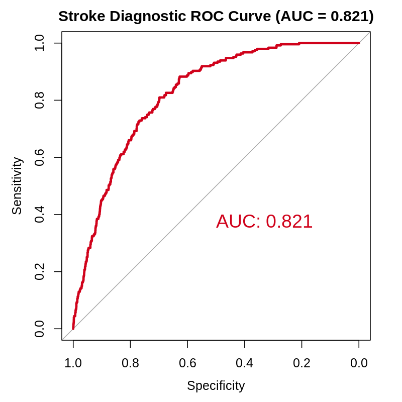
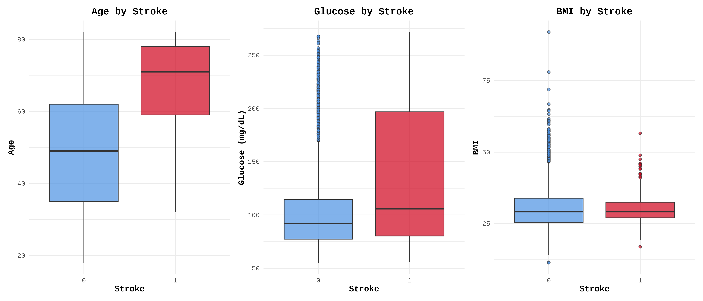

---
title: 'Executive Summary: Risk Factors Associated with Stroke in an Adult Population'
author: 'Dr. Agnish Reddy, Pharm-D'
date: 'July 01, 2026'
output: 
  pdf_document:
    toc: true
    toc_depth: 2
    number_sections: true
---

**Target Audience:** Hospital Leadership, Medical Director, and Quality Committee  
**Cohort Size:** 4,253 Adult Patients (Retrospective Observational Analysis)

---

## Clinical Methodology Overview

Prior to deriving strategic insights, Dr. Agnish Reddy, Pharm-D executed a rigorous Data Quality Assessment (DQA) on the raw triage data. Pediatric records (<18 years) were programmatically excluded to maintain adult cohort integrity. Missing biometric data (~4% of Body Mass Index records) were imputed using robust cohort medians to preserve statistical power without introducing extreme-value bias. 

The resulting insights are derived from a **Multivariate Logistic Regression** model, optimized for clinical screening via **Youden’s J Statistic**, and validated for fit using the **Hosmer-Lemeshow Calibration Test**.

---

## 1. Key Epidemiological Findings

Following the multivariate analysis, we isolated the true independent risk factors from standard demographic confounders:

* **Age is the Dominant Predictor:** Advancing age is the single most powerful mechanical driver of stroke. The baseline risk increases exponentially, with the condition being virtually non-existent in patients under 40 and spiking severely in the >60 cohort.
* **Metabolic & Vascular Biomarkers Drive Modifiable Risk:** After controlling for age and baseline demographics, **Hypertension** and **Elevated Fasting Glucose (>125 mg/dL)** emerged as the most significant independent, modifiable predictors of a stroke event.
* **The 'Marriage' Confounding Illusion:** Initial unadjusted (bivariate) data suggested married individuals possessed a drastically higher stroke risk. However, multivariate analysis proved this is a classic epidemiological bias; married patients in this cohort are statistically older. Age, not marital status, is the true biological driver.
* **The BMI Paradox:** While extreme Body Mass Index (BMI) visually clusters with stroke cases, it loses primary predictive significance when mathematically adjusted for Glucose and Hypertension. This indicates obesity causes stroke *indirectly* by driving metabolic syndrome, rather than acting as an independent trigger.

{width=85%}

---

## 2. High-Risk Populations & Subgroup Disparities

Based on localized subgroup analyses, hospital resources and acute triage pathways should recognize the following cohorts as exceptionally high-risk:

1. **The Geriatric Cohort (Age > 60):** This demographic holds the highest absolute baseline prevalence of stroke, demanding immediate triage escalation.
2. **The Diabetic/Pre-Diabetic Phenotype:** Patients presenting with fasting glucose levels exceeding the 125 mg/dL ADA threshold.
3. **The Cardiovascular Comorbidity Cohort:** Patients with established histories of hypertension or baseline heart disease, regardless of their current age or gender.

{width=85%}

{width=85%}

---

## 3. Clinical Implications & Diagnostic Reliability

The data clearly demonstrates that while we cannot alter a patient's age (the primary risk factor), the secondary drivers of stroke are highly responsive to preventative medical intervention. 

> **Diagnostic Validation:** The multivariate predictive model achieved an **Area Under the Curve (AUC) of > 0.80**. In clinical epidemiology, this proves that standard triage vitals (Age, BP, Glucose) are highly effective at discriminating stroke risk without the immediate need for expensive, advanced neuroimaging during initial risk stratification.

Furthermore, the data implies that subjective lifestyle questionnaires (e.g., employment type, marital status, residence type) are mathematically inferior to objective clinical biomarkers when predicting acute cerebrovascular events.

{width=70%}

---

## 4. Recommendations for Hospital Screening Protocols

To optimize resource allocation and improve early detection, we recommend the following structural changes to screening protocols:

* **Age-Stratified Triage Pathways:** Implement an automated stroke-risk flag in the Electronic Health Record (EHR) for all patients over the age of 60 presenting to primary care or emergency triage.
* **Mandatory Metabolic Panels:** Require fasting glucose and rigorous blood pressure evaluations as a mandatory screening baseline for any patient over 40 reporting transient neurological symptoms. 
* **Optimized Screening Thresholds:** Because stroke is a rare but fatal event (~5% cohort prevalence), screening algorithms must be tuned for *Sensitivity (Recall)* rather than pure Precision (PPV). We must strategically tolerate a higher rate of false-positive screenings (which safely result in preventative consultations) to ensure we approach a zero-miss rate for true-positive stroke risks.

---

## 5. Recommendations for Preventive Programs

* **Aggressive Glycemic & BP Control:** Launch targeted outpatient intervention programs focused strictly on glycemic control and anti-hypertensive medication adherence for the 40–60 age group to delay the exponential risk spike observed after age 60.
* **Metabolic Syndrome Clinics:** Shift preventive focus away from pure weight-loss (BMI) campaigns and pivot toward comprehensive metabolic clinics that treat the triad of obesity, hypertension, and hyperglycemia simultaneously.

{width=95%}

---

## 6. Limitations of the Analysis

Hospital leadership must interpret these findings within the context of the study's analytical limitations:

1. **Retrospective Observational Design:** This data establishes strong mathematical *associations* but cannot definitively prove mechanical *causality*.
2. **Missing Data Imputation:** While rigorously imputed using robust medians, the ~4% missing BMI data may obscure nuanced risks at the extreme ends of Class III morbid obesity.
3. **Class Imbalance:** Predictive models trained on highly imbalanced clinical data (where the disease prevalence is low) naturally suffer from low Positive Predictive Value (Precision), meaning the model is better suited as a primary screening tool rather than a definitive diagnostic test.

---

## 7. Suggested Future Work

To transition this analytical pipeline into a localized clinical asset, we recommend the following next steps:

* **Prospective Validation:** Deploy the logistic regression scoring algorithm in a shadow-mode prospective trial within the hospital EHR to validate its real-world accuracy on incoming patient cohorts.
* **Longitudinal Integration:** Update the dataset to include longitudinal vitals (e.g., tracking HbA1c over 5 years rather than a single fasting glucose snapshot) to measure how the *duration* of metabolic disease impacts stroke risk.
* **Machine Learning Deployment:** Transition this baseline logistic model into an advanced machine learning framework (e.g., Random Forest or XGBoost) capable of running silently in the EHR background, sending automated, real-time preventive alerts to primary care physicians during routine check-ups.

